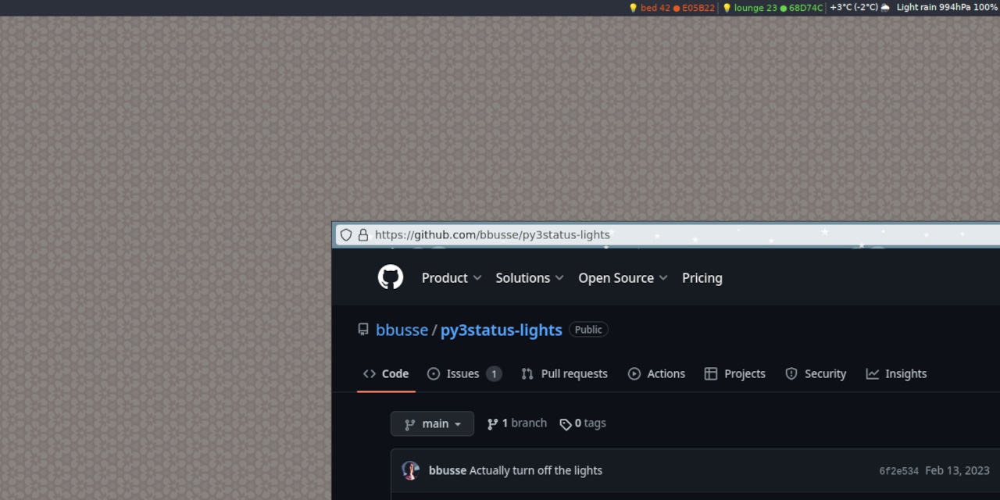

# py3status-lights
A [py3status](https://github.com/ultrabug/py3status) module to control various LED lights like [WLED](https://kno.wled.ge/) based devices

Currently supported are devices taking hex encoded colors for consecutive LEDs as input.
A configurable amount of LEDs representing a light source can be set to either one out of a set of predefined colors - one at a time, or a custom one.

# Configuration
## Parameters
* leds - The number of LEDs
* proto - The protocol to use: RGB versus DRGB
* icon - A module icon
* icon_color - The icon to indicate the currently set color
* color_picker - The command to run for picking a color

# Usage
`left-click` Toggles through the predefined colors  
`right-click` Turns off the light  
`scroll-up` Increases the number of LEDs to control  
`scroll-down` Decreases the number of LEDs to control

# Targets
## WLED
Like other firmwares, [WLED](https://kno.wled.ge/) can be controlled with UDP packets containing the colors to set for individual LEDs. For this to work enable UDP Sync
and set the port to 2342 (the default in this module) or some other port.

# Resources
[py3status](https://github.com/ultrabug/py3status)  
[py3status docs](https://py3status.readthedocs.io/en/latest/)  
[WLED UDP](https://github.com/Aircoookie/WLED/wiki/UDP-Realtime-Control)  
